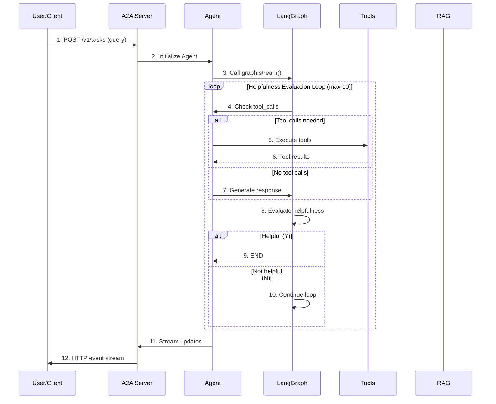
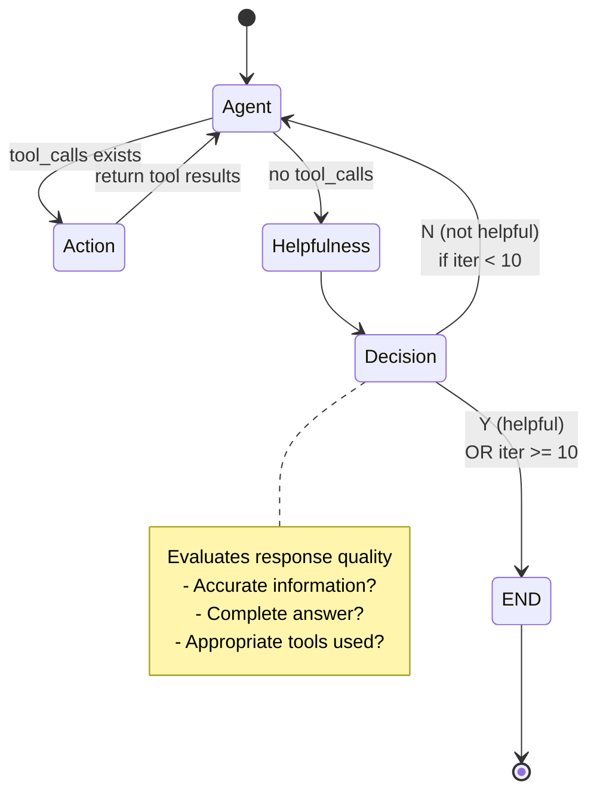

# LangGraph Agent Architecture - Visualization

## Architecture Diagram (Mermaid)

```mermaid
graph TB
    subgraph "Client Layer"
        CLI[A2A Client<br/>test_client.py]
    end

    subgraph "Server Layer"
        SERVER[A2A Server<br/>agent_executor.py<br/>FastAPI + RPC]
    end

    subgraph "Agent Layer"
        AGENT[Agent Core<br/>agent.py<br/>ResponseFormat]
    end

    subgraph "LangGraph Core"
        direction TB
        A[Agent Node<br/>LLM + Tools]
        B[Action Node<br/>Tool Execution]
        C[Helpfulness Node<br/>Quality Check]
        D[END State]

        A -->|tool calls?| B
        B -->|return results| A
        A -->|no tools| C
        C -->|Y helpful| D
        C -->|N retry max 10| A
    end

    subgraph "Tools"
        T1[Tavily Search<br/>Web Search]
        T2[ArXiv Search<br/>Papers]
        T3[RAG Retrieval]
    end

    subgraph "RAG System"
        direction LR
        R1[PDF Loader]
        R2[Text Chunker]
        R3[Embeddings]
        R4[Qdrant Vector Store]
        R5[Retrieve]
        R6[Generate]

        R1 --> R2 --> R3 --> R4 --> R5 --> R6
    end

    subgraph "LLM"
        LLM[OpenAI GPT-4o-mini<br/>or GPT-4o]
    end

    CLI -->|HTTP/RPC| SERVER
    SERVER --> AGENT
    AGENT -->|Stream| A
    A <-->|tool calls| T1
    A <-->|tool calls| T2
    A <-->|tool calls| T3
    T3 -.->|uses| R5
    A <-->|queries| LLM
    C <-->|evaluates| LLM

    style A fill:#FFF9C4
    style B fill:#FFF9C4
    style C fill:#FFF9C4
    style D fill:#FFEB3B
    style SERVER fill:#BBDEFB
    style AGENT fill:#C8E6C9
    style T1 fill:#F8BBD0
    style T2 fill:#F8BBD0
    style T3 fill:#F8BBD0
    style R4 fill:#E1BEE7
```

## Flow Sequence (Mermaid)



## State Flow Diagram



## Component Details

### 1. A2A Protocol Layer

- **Protocol**: Agent-to-Agent communication protocol
- **Endpoints**: RESTful API with RPC-style messaging
- **Streaming**: Event-based real-time updates

### 2. Agent Graph Structure

#### Nodes:

1. **Agent Node**: Main LLM with tool binding

   - Calls model with conversation history
   - Generates tool calls or final response
   - Extracts structured ResponseFormat

2. **Action Node**: Tool execution

   - Executes tools from tool belt
   - Returns tool results to agent

3. **Helpfulness Node**: Quality evaluation
   - Assesses response quality
   - Determines if response is "extremely helpful"
   - Returns Y (helpful) or N (retry)

#### Edges:

- Conditional routing based on tool_calls
- Loop protection (max 10 iterations)
- Memory checkpointer for state persistence

### 3. Tool Belt

| Tool              | Purpose               | Data Source |
| ----------------- | --------------------- | ----------- |
| **Tavily Search** | Real-time web search  | Internet    |
| **ArXiv Search**  | Academic paper search | ArXiv API   |
| **RAG Retrieval** | Document Q&A          | Local PDFs  |

### 4. RAG System Flow

```
PDF Documents → Text Loader → Chunking → Embeddings → Vector Store
                                                           ↓
                                         Query → Retrieve → Generate → Response
```

### 5. Response States

| State            | Description                | User Action           |
| ---------------- | -------------------------- | --------------------- |
| `input_required` | Need more info from user   | Provide clarification |
| `completed`      | Task successfully finished | Review result         |
| `error`          | Error occurred             | Retry or report       |

## Key Features

1. **Helpfulness Loop**: Self-evaluation of response quality
2. **Tool Integration**: Multiple data sources (web, academic, documents)
3. **Streaming**: Real-time response updates
4. **State Management**: Conversation context preservation
5. **A2A Compliance**: Standard protocol for agent communication
6. **Loop Protection**: Prevents infinite loops with max iteration count
